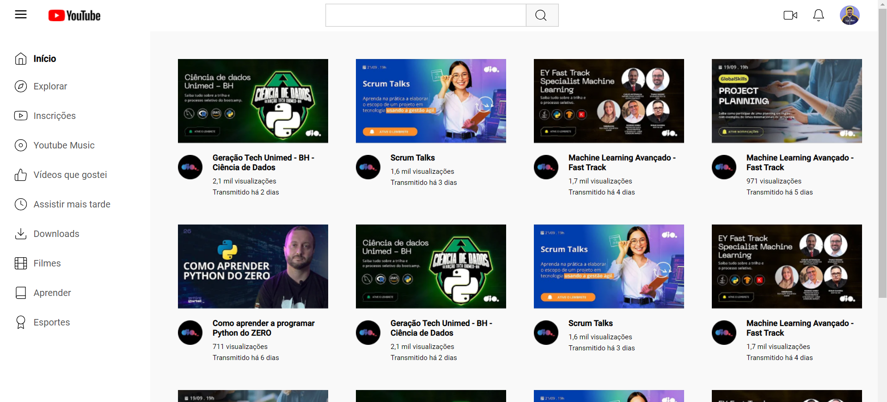

## 🏋️‍♂️ Desafio de Projeto HTML e CSS: Reproduzindo a Listagem do YouTube com Grid Layout no CSS.

Desafio de projeto proposto no curso de Formação CSS Web Developer para criação de uma página de listagem do Youtube.  
Os temas abordados são:   
- As propriedades básicas da linguagem de estilização.
- As unidades de medidas. 
- Grid Layout. 

Além de outros recursos.

## 💻 Tecnologias utilizadas nesse projeto:

  
  

## 💻 Preview:
- Veja como ficou o projeto acessando: [nesse link do Github Pages](https://ernandesneponuceno.github.io/Reproduzindo-a-Listagem-do-YouTube-com-Grid-Layout/)
  

## 🤔 O que aprendi com esse projeto:
- Aprimorar minhas habilidades em HTML e CSS.
- Propriedades de layout e visualização.
- Grid Layout.
- Estilização de botões e ícones.
- Estilização de texto, posição dos elementos e boas práticas de design.

## 📌 Créditos:
- **Assets:** Disponível no protótipo do Figma disponibilizado no curso.(https://www.figma.com/file/KknwioExyqKD3D2eSVFrcW/Desafio-Grid---DIO?type=design&node-id=0-1&mode=design&t=rshzxYiYq4LtuZXm-0)

